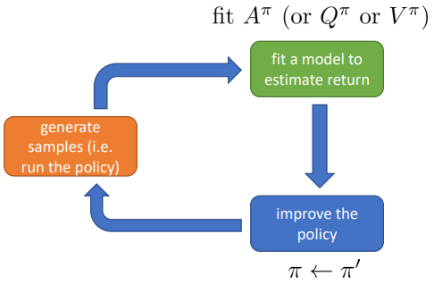
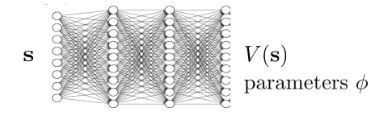

# Value Function RL
In Value-Based RL we use the advante function to define our policy.

According to it's definition, the advantage function  tell us how much better  is w.r.t. the average action according to policy .

: best action from , if we follow . This is at least as good as  regardless of .
As shown in [Fig. 1](#fig-v-function-learning), it is possible to use such arg max formulation of the advantage function to define our policy.

    
     
    <a name="fig-v-function-learning"> Fig. 1: Value function learning process.</a>

In real-world scenarios we have to represent the value function  as a neural network because it has to scale to every state.

    
     

Then we can define a training loss function as: .
Finally we can use a fitted value iteration algorithm:
1. 
2. 
Yet such iterative algorithm assume that we have a model ov the environment because we need to compute the value function for every action (max function) at every state. However we can't go back to previous state if we don't have a model of the environment.

It is possible to overcome such limitation using the Q-function formalism:
1. 
2. 
where 