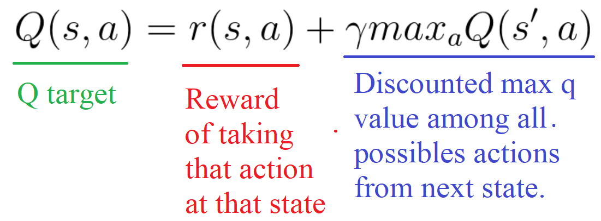
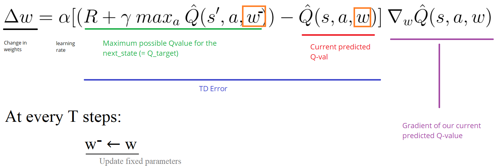

# PyTorch DQN

A pytorch implementation of the DQN algorithm proposed in http://www.nature.com/nature/journal/v518/n7540/full/nature14236.html?foxtrotcallback=true

All the code is based on @dennybritz RL tutorial (https://github.com/dennybritz/reinforcement-learning)

## Requrements
All the requred library are in the env.yml files.
Gym is vizdoom is required to run the enviroment's simulator.

## Deep Q-learning

Instead of using a table, we employ a neural network to learn the expected future of an action.
Namely, Doom is a complex environment; thus it is impractical to have a table for each possible state.
[Fig 1.](#fig-deep_q_learning-vs-q_learning) represents the difference between Q-learning and Deep Q-learning where a neural network is used to approximate the q-values.

    
     
    <a name="fig-deep_q_learning-vs-q_learning"> Fig. 1: Deep Q-learning vs. Q-learning</a>

## Network architecture
A convolutional neural network is used to extract a set of feature from the environment.
Subsequently, a dense layer is used to estimate the q-values for each input state and actions.
The full model is specified in [Fig. 2](#fig-deep_q_learning_model).

    
     
    <a name="fig-deep_q_learning_model"> Fig. 2: Deep Q-learning model</a>

Note that, a stack of 4 frames shapes our input feature (each frame is represented in grey scale; thus the network's input is `batch-size x hight x width x 4`).
As output, we obtain a vector of Q-values. 
The action associated to the highest Q-value is then performed by the agent.
As we known, the Q-values represents our expected future reward. 
Thus, it is not the real future reward, but over time the network is getting better and better at estimating such expectation.

Based on the Bellman equation, the Q-learning update function is:

    
     
    <a name="eq-q_learning_update"> Eq. 1: Q-value update formula</a>

However, Deep Q-learning has to update its weight to reduce the TD-error:

    
     
    <a name="eq-deep_q_learning_update"> Eq. 2: Deep Q-value update formula</a>

 

## Fixed Q-targets
In [Eq. 2](#eq-deep_q_learning_update) we notice that the TD error is computed between the target Q-values (Q values at the next state and following a perfect policy) and the current estimate of the Q-values.
Thus, the Deep Q-learning is an off-policy algorithm, because the Q-values are update following an e-greedy policy; while the Q-targets are computed with a perfect policy.
However, the Q-targets are **estimated** (we don’t have any idea of the real TD target) using the same weights to estimate the Q-values.
As a consequence, there is a big correlation between the Q-target and the parameters we are changing.
Therefore, it means that at every step of training, our Q-values shift but also the Q-target values shifts. 
That is, we’re getting closer to our target but the target is also moving. 

    
     
    <a name="eq-q_target_update"> Eq. 3: Q-target update functions</a>

 

To solve such chicken and egg problem, researchers propose to use two different networks.
One updated at each steps to estimate the Q-values.
And one that has use freezed weights to estimate the Q-targets values. 

    
     
    <a name="eq-tn_q_target_update"> Eq. 4: Target Network update functions for estimate the Q-target values</a>

 