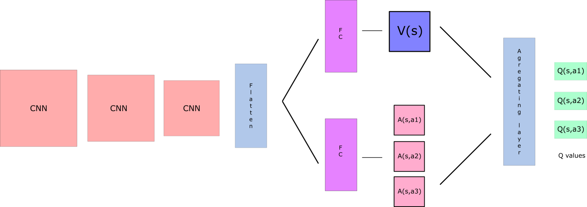

# Double DQN

The traditional DQN implementation tend to overestimate the Q-values.
The problem is that initially we are not sure to take, in  the next-state, the the action with the highest Q-value.
Because the Q-values depend on the training done so far.
Therefore, taking the maximum Q-value (which is noisy) as the best action to take can lead to false positives. 
If non-optimal actions are regularly given a higher Q value than the optimal best action, the learning will be complicated.

Thus, we use two networks to decouple the action selection from the target Q value generation. 
We:
- use our DQN network to select what is the best action to take for the next state (the action with the highest Q value)
- use our target network to calculate the target Q value of taking that action at the next state.

Formally, the TD-error is computed as:

    
     
    <a name="eq-deep_q_learning_update"> Eq. 1: TD-error computed in the Double DQN</a>

# Dueling DQN
Instead of computing directly the Q-values, in the dueling architecture we compute the advantage function.
That is, we decompose `Q(s,a)` as:
- **V(s)**: the value of being at that state
- **A(s,a)**: the advantage of taking that action at that state (how much better is to take this action versus all other possible actions at that state).

    
     
    <a name="eq-deep_q_learning_update"> Eq. 2: Q-values decomposition</a>

With Dueling DQN, we want to separate the estimator of these two elements, using two new streams:
- one that estimates the state value V(s);
- one that estimates the advantage for each action A(s,a).

Finally, we aggregate the two streams by a difference w.r.t. the mean values:

    
     
    <a name="eq-deep_q_learning_update"> Eq. 3: Stream merge</a>

 
The overall model structure is reported in [Fig. 1](#fig-dueling-model).

    
     
    <a name="fig-dueling-model"> Fig. 1: DDQN model</a>

